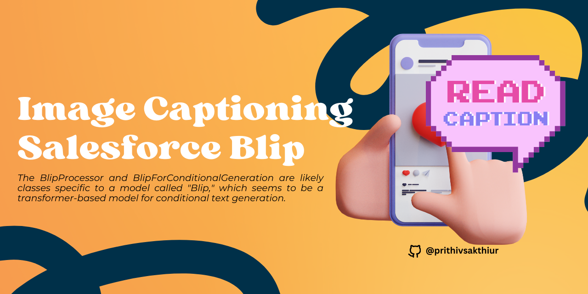
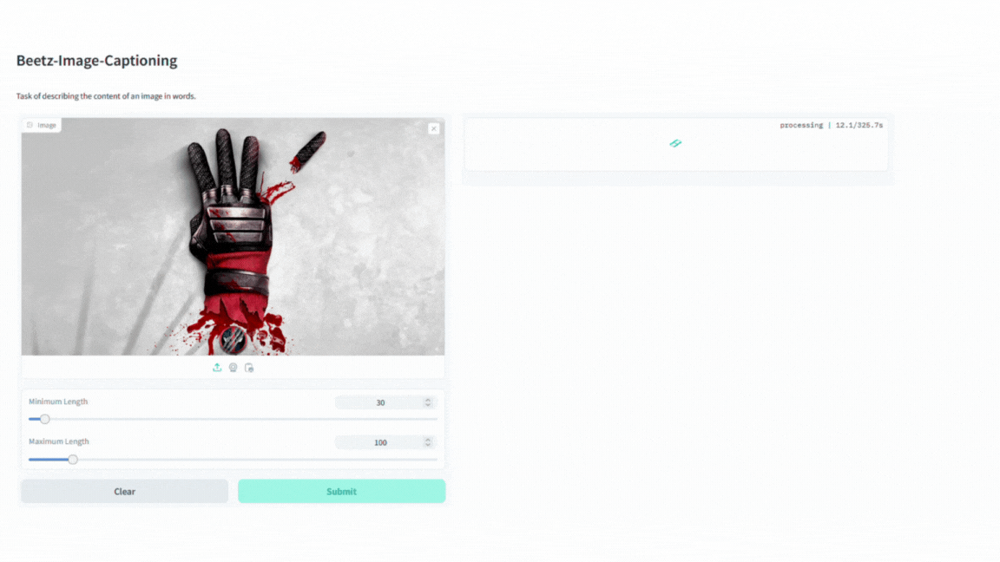
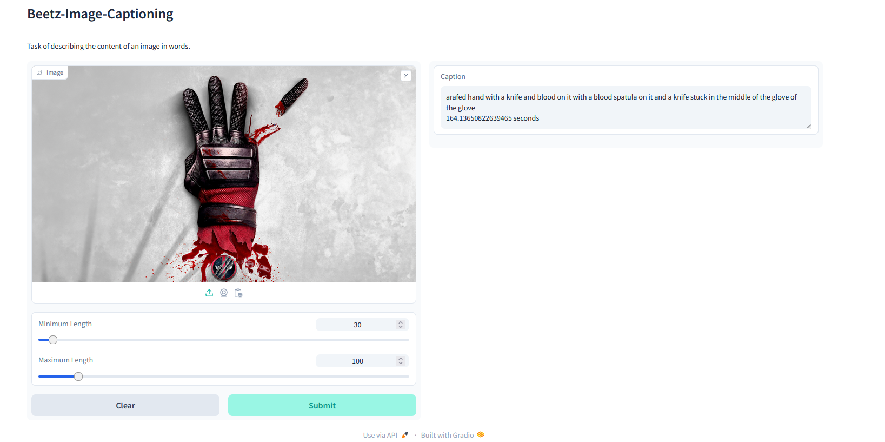

ℹ️Recommended to Deploy inside Huggingface Workspaces

🥤Check out the configuration reference at https://huggingface.co/docs/hub/spaces-config-reference

🥤Working Gradio Space : https://huggingface.co/spaces/prithivMLmods/Beetz-Image-Captioning

🥤Model in HuggingFaces : https://huggingface.co/prithivMLmods/Beetz-Image-Captioning-Blip

🚀Uploading Image to Captioning Inference

🚀Result for the Image

